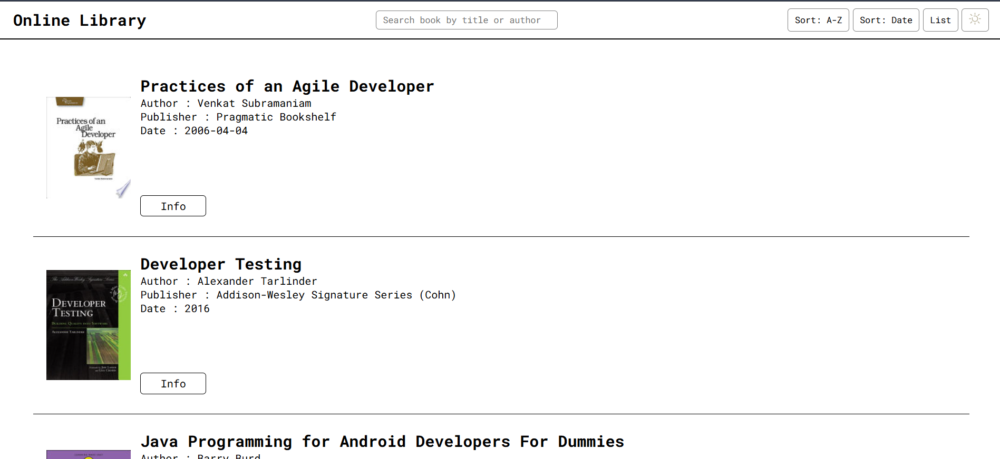
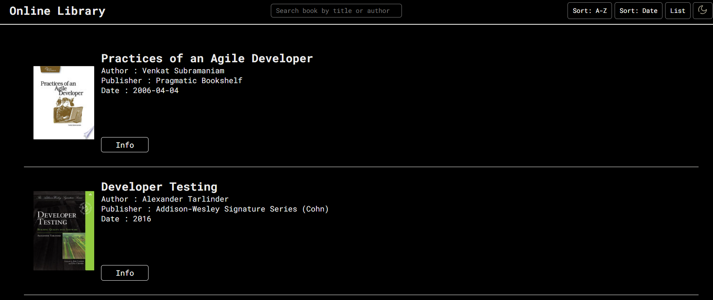
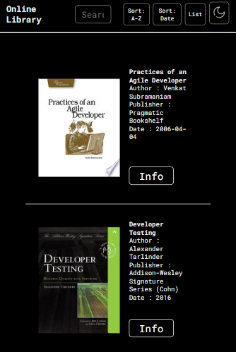

# Book Management System - Online Library

# Overview
This is a dynamic web application that allows users to browse, search, and explore books with an intuitive interface and multiple interactive features.

## 🌐 Live Demo

### Link : [Online Library](https://cohort-library-online.netlify.app/)

## Screenshots 

### Desktop :

### Mobile :

## 🌟 Features

### Book Browsing

- Fetch and display books from an external API
- Pagination support
- View books in List or Grid format
- Toggle between different display modes

### Sorting & Filtering

- Sort books alphabetically
- Sort books by published date
- Real-time search functionality with debounce
- Instant book filtering

### User Experience

- Dark/Light theme toggle
- Responsive design
- Quick access to book information links

### 🛠 Tech Stack

Frontend:

- HTML5
- CSS3
- Vanilla JavaScript (ES6+)

### Key Technologies

- Fetch API for data retrieval
- Async/Await for asynchronous operations
- DOM Manipulation
- Event Handling
- Local State Management

### 📦 Project Structure

    book-discovery-app/
    │
    ├── index.html       # Main HTML file
    ├── styles.css       # Styling
    ├── app.js           # Main JavaScript logic
    └── assets/          # Images and additional resources

## 🔧 Key Components

### JavaScript Functionality

- fetchBooks(): Retrieves book data from API
- createBookCards(): Renders book cards dynamically
- updatePageNumber(): Manages pagination
- Theme Toggle: Switches between light and dark modes

### Interaction Features

- Prev/Next page navigation
- List/Grid view toggle
- Alphabetical and date-based sorting
- Search with debounce
- Theme switching

### 🌈 Customization

You can easily customize:
- API endpoint
- Number of books per page
- Sorting criteria
- Theme colors

### 🔍 API Reference

- Endpoint: https://api.freeapi.app/api/v1/public/books
- Parameters:
    - page: Current page number
    - limit: Number of books per page (default: 12)

### ⚠️ Limitations

- Requires active internet connection
- Book data depends on external API availability
- Limited to 12 books per page